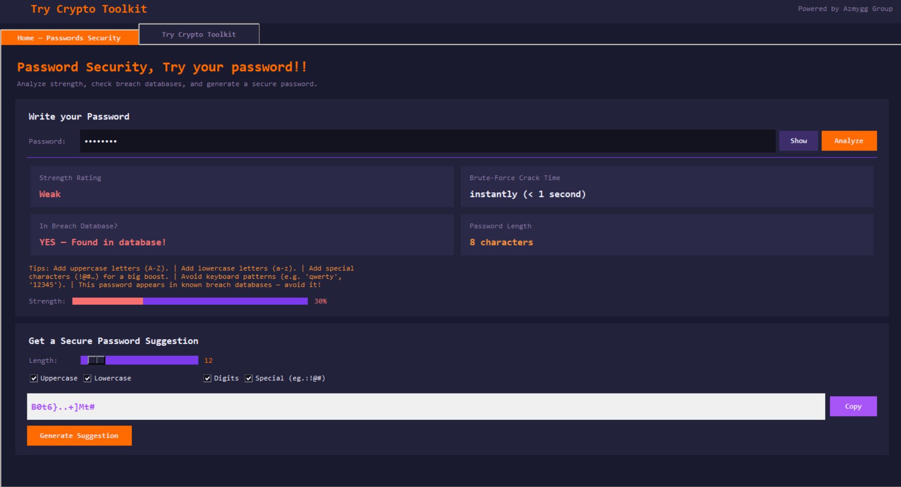
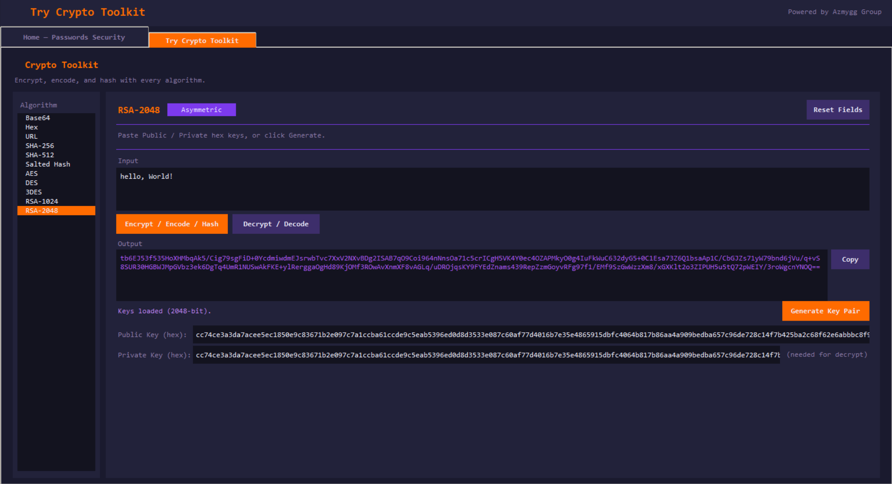

<div align="center">

# 🔐 CryptoToolkit

### A full-featured cryptography desktop application built in Python


</div>

---

## 📌 About

**CryptoToolkit** is a graphical desktop application that lets you encrypt, decrypt, encode, decode, and hash text using 10 industry-standard cryptographic algorithms — all in one clean dark-themed interface.

Built as a cryptography course project, it covers everything from symmetric block ciphers to asymmetric RSA, encoding schemes, and secure password hashing.

---

## ✨ Features

### 🔒 Symmetric Encryption
| Algorithm | Modes Supported |
|-----------|----------------|
| **AES** | ECB · CBC · CFB · OFB · CTR · GCM |
| **DES** | ECB · CBC · CFB · OFB · CTR |
| **3DES** | ECB · CBC · CFB · OFB · CTR |

### 🔑 Asymmetric Encryption
| Algorithm | Key Sizes |
|-----------|-----------|
| **RSA** | 1024-bit · 2048-bit |

### 📦 Encoding & Decoding
- **Base64** — encode / decode binary data as ASCII text
- **Hex** — encode / decode bytes as hexadecimal digits
- **URL Encoding** — percent-encode / decode (RFC 3986, supports Arabic & Unicode)

### #️⃣ Hashing
- **SHA-256** — 256-bit one-way digest
- **SHA-512** — 512-bit one-way digest
- **Salted Hash** — SHA-256 with a random 16-byte salt (timing-safe verification)

### 🛡️ Password Security Center
- Live strength scoring (0–100) with improvement tips
- Brute-force crack time estimator
- Breach database check via `rockyou.txt`
- Secure password generator with configurable rules

---

## 🖥️ Screenshots

| Home — Password Analyzer | Crypto Toolkit — AES |
|:---:|:---:|
|  |  |

---

## 🚀 Getting Started

### Requirements
- Python 3.10+
- `cryptography` library

### Installation

```bash
# 1. Clone the repository
git clone https://github.com/azmygg/CryptoToolkit.git
cd CryptoToolkit

# 2. Install the only dependency
pip install cryptography

# 3. Run the application
python crypto_gui.py
```

### Optional
Place `rockyou.txt` in the project folder to enable the breach database check on the Home page.

---

## 📁 Project Structure

```
CryptoToolkit/
│
├── crypto_lib.py       # Cryptographic backend — all algorithms & tools
├── crypto_gui.py       # Tkinter GUI — two-tab desktop application
├── rockyou.txt         # (optional) breach password database
├── README.md
└── screenshots/        # (optional) app screenshots
```

### File Responsibilities

| File | Role |
|------|------|
| `crypto_lib.py` | All crypto logic: AES, DES, 3DES, RSA, Base64, Hex, URL, SHA-256, SHA-512, Salted Hash, Password Generator |
| `crypto_gui.py` | GUI only — imports from `crypto_lib.py`, zero crypto logic of its own |

---

## 🧠 How It Works

### Symmetric Encryption (AES / DES / 3DES)
- User provides a hex key (or clicks **Gen Key** for a random one)
- Selects a cipher mode — IV is shown/hidden automatically depending on the mode
- Input text is encrypted → output is a Base64 string
- The same key + IV is needed to decrypt

### Asymmetric Encryption (RSA)
- Click **Generate Key Pair** → public and private keys appear as hex strings
- Copy and save both keys
- Encrypt with the public key → decrypt with the private key
- Uses **OAEP + SHA-256** padding (stronger than PKCS#1 v1.5)

### Hashing
- One-way — the Decrypt button is hidden for hash algorithms
- Salted Hash generates a fresh 16-byte random salt on every call
- Verification uses `hmac.compare_digest()` for constant-time comparison

---

## 🔧 Tech Stack

| Layer | Technology |
|-------|------------|
| Language | Python 3.10+ |
| GUI | Tkinter (built-in) |
| Crypto | `cryptography` library (OpenSSL backed) |
| Randomness | `secrets` module (CSPRNG) |
| Hashing | `hashlib` (SHA-256 / SHA-512) |

---

## 📄 License

This project is licensed under the **MIT License** — feel free to use, modify, and distribute it.

---

<div align="center">
Made with 🔐 by <a href="https://github.com/azmygg">Mahmoud Azmy</a>
</div>
